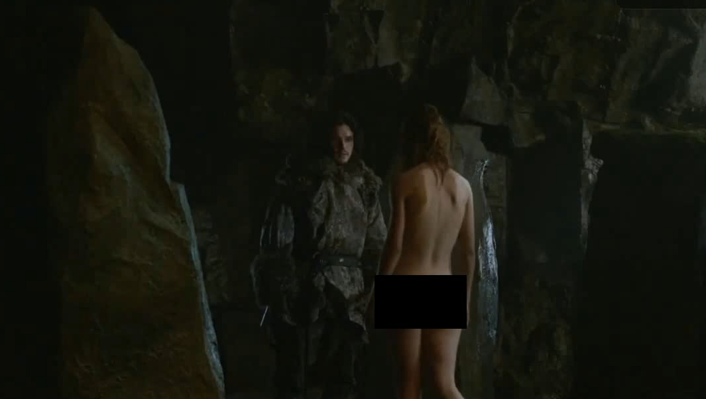

# NSFW Video Analysis and Censoring Using NudeNet

## Overview
This project leverages the **NudeNet library** to provide a comprehensive solution for analyzing and censoring NSFW (Not Safe For Work) content in videos and images. With the increasing prevalence of user-generated content, ensuring compliance with community guidelines and content policies has become essential. This system enables efficient detection and censorship of explicit material, ensuring content moderation with accuracy and scalability. The process involves resizing videos for optimization, analyzing individual frames for explicit content, and applying targeted censorship using Gaussian blur. Additionally, the system generates detailed reports for further evaluation, making it suitable for both research and practical implementation.

The repository is organized into three main components: video analysis, CSV generation for detection thresholds, and an image censoring demonstration. Each component highlights a unique functionality of the system and demonstrates the capabilities of the NudeNet library.

## Features
- **Video Analysis and Censoring**:
  - Efficiently processes videos to detect and censor NSFW content in individual frames.
  - Supports both GPU and CPU-based processing, enabling flexibility for diverse hardware setups.
  - Reduces video size before analysis to enhance processing speed and resource usage.
- **CSV Generation**:
  - Creates a comprehensive CSV file documenting detected NSFW classes and their confidence thresholds for each frame in a video.
  - Useful for understanding patterns in NSFW detection and fine-tuning the system.
- **Image Censoring Demonstration**:
  - Provides a straightforward demonstration of NudeNet's capabilities in detecting and censoring explicit content in single images.
  - Serves as an introductory tool for understanding the functionality of the library.

## File Structure
- **`Video Analyses.ipynb`**:
  - The primary notebook for video analysis and censorship.
  - Includes functionality to resize videos for optimization, detect explicit content frame by frame, and output a censored video.
  - Offers options to select GPU or CPU processing modes, depending on available hardware.
- **`CSV Generation.ipynb`**:
  - Generates a detailed CSV report containing information about detected NSFW classes and their confidence thresholds across all frames in a video.
  - Useful for data analysis, debugging, or understanding the detection trends in videos.
- **`NudeNet.ipynb`**:
  - Demonstrates basic functionality of the NudeNet library by detecting and censoring NSFW content in a single image.
  - An ideal starting point for users new to NudeNet.
- **`sample_frame_censored.jpg`**:
  - Example output showcasing a single censored video frame with explicit areas blurred.

## Usage
### Prerequisites
To run the notebooks, ensure you have Python installed along with the following dependencies:
- NudeNet
- OpenCV
- Pandas
- MoviePy

Install the required Python libraries using the following command:
```bash
pip install nudenet opencv-python pandas moviepy
```

### Running the Notebooks
1. **Video Analysis**:
   - Open `Video Analyses.ipynb` in a Jupyter Notebook environment.
   - Specify the path to the input video.
   - Choose GPU or CPU processing mode based on your hardware.
   - Run the notebook to analyze and censor the video. The censored video will be saved in the specified output path.

2. **Generate CSV Reports**:
   - Open `CSV Generation.ipynb`.
   - Specify the video path to be analyzed.
   - Run the notebook to create a CSV report documenting frame-wise NSFW classes and confidence thresholds.
   - The generated CSV can be used for further analysis or debugging.

3. **Image Censoring Demonstration**:
   - Open `NudeNet.ipynb`.
   - Provide the path to an image containing explicit content.
   - Run the notebook to detect and censor explicit regions. The output image will show blurred areas for detected NSFW content.

## Example Output
### Censored Frame:
Below is an example of a single frame censored using the NudeNet library:


This frame demonstrates the targeted censorship applied to explicit areas while retaining the integrity of the rest of the image. The system uses Gaussian blur for censorship, ensuring the content becomes unrecognizable while maintaining a clean visual output.

## Contributions
We welcome contributions from the community! Whether it’s fixing bugs, improving documentation, or adding new features, your input is valuable. Please fork the repository, make your changes, and submit a pull request for review.

## License
This project is licensed under the MIT License. See the `LICENSE` file for details.

## Acknowledgments
This project uses the NudeNet library, an open-source solution for NSFW detection and censorship. Special thanks to the contributors of NudeNet for their efforts in creating and maintaining the library.
